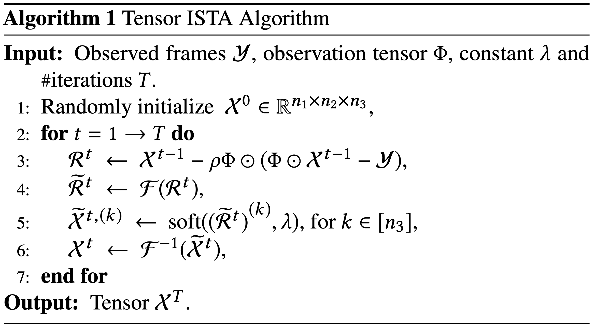
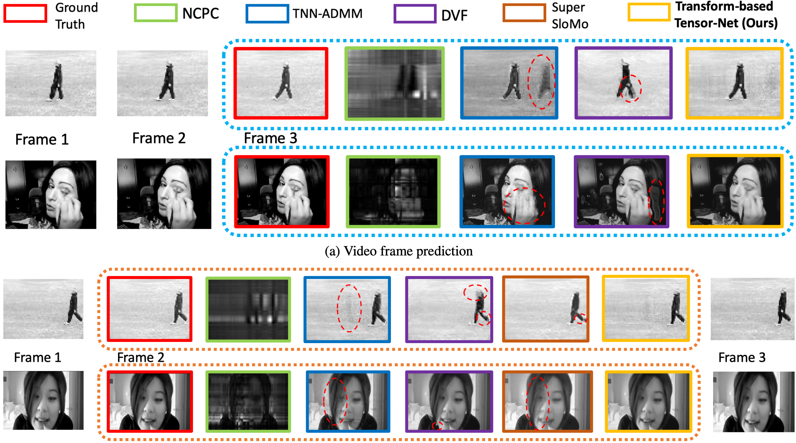

# Transform_Based_Tensor_Net
A novel multi-phase deep neural network Transform-Based Tensor-Net that exploits the low-rank structure of video data in a learned transform domain, which unfolds an Iterative Shrinkage-Thresholding Algorithm (ISTA) for tensor signal recovery. 

## Tensor ISTA Algorithm



## Network Architecture


## Visualization Examples


## Dataset
### KTH
https://www.csc.kth.se/cvap/actions/

Database contains six types of human actions (walking, jogging, running, boxing, hand waving and hand clapping) performed several times by 25 subjects in four different scenarios: 

1) Outdoors; 

2) Outdoors with scale variation;

3) Outdoors with different clothes;

4) Indoors.

### UCF-101
https://www.crcv.ucf.edu/data/UCF101.php

The videos in 101 action categories are grouped into 25 groups, where each group can consist of 4-7 videos of an action. The videos from the same group may share some common features, such as similar background, similar viewpoint, etc. 

The action categories can be divided into five types: 

1) Human-Object Interaction; 

2) Body-Motion Only; 

3) Human-Human Interaction; 

4) Playing Musical Instruments; 

5) Sports. 

## Data Preparation
Execute DataGenerator.m to transform the dataset into a mat file that matches the data requirements of the neural network inputs.
In addition, the input requirements can be modified in DefineParam.py. 

## Neural Network Training
Edit TrainModel.py to modify the Tensor-Net structure, and execute Train.py to train the network.

## Testing
Edit ReconstructionImage.py to adjusting the output of test results, and execute Reconstruction.py for network testing.

## Citation
```
@inproceedings{zhang2020tensornet,
 author = {Yimeng Zhang, Xiao-Yang Liu, Bo Wu, and Anwar Walid},
 title = {Video synthesis via transform-based tensor neural network},
 booktitle = {Proceedings of the 28th ACM international conference on Multimedia.},
 month = {October},
 year = {2020} 
}
```

