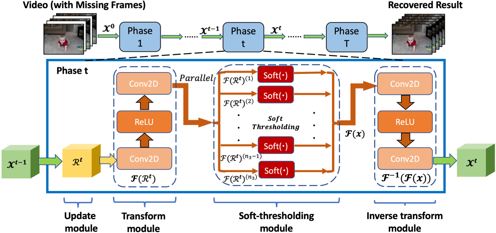

# Transform_Based_Tensor_Net
A novel multi-phase deep neural network Transform-Based Tensor-Net that exploits the low-rank structure of video data in a learned transform domain, which unfolds an Iterative Shrinkage-Thresholding Algorithm (ISTA) for tensor signal recovery. 

## Tensor ISTA Algorithm

## Network Architecture

## Visualization Examples

## Dataset
### KTH
https://www.csc.kth.se/cvap/actions/

Database contains six types of human actions (walking, jogging, running, boxing, hand waving and hand clapping) performed several times by 25 subjects in four different scenarios: outdoors s1, outdoors with scale variation s2, outdoors with different clothes s3 and indoors s4 as illustrated below.

### UCF-101
https://www.crcv.ucf.edu/data/UCF101.php

The videos in 101 action categories are grouped into 25 groups, where each group can consist of 4-7 videos of an action. The videos from the same group may share some common features, such as similar background, similar viewpoint, etc. 

The action categories can be divided into five types: 1)Human-Object Interaction 2) Body-Motion Only 3) Human-Human Interaction 4) Playing Musical Instruments 5) Sports. 

